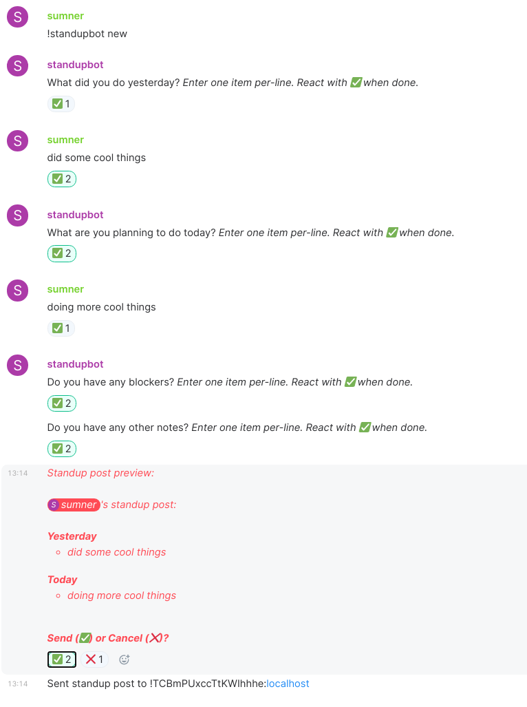

# standupbot

Standupbot helps automate the process of writing nicely formatted daily standup
posts and sending that standup post to a shared, configurable standup room.

Standupbot guides you through a set of questions to help you create your standup
post, and then posts in the standup room. It can also remind you to write your
standup post at a specified time.



## Usage

All interaction with the bot should be done in a DM with the bot. It is
important that the bot is at least moderator in the room so that it can store
state events in the room.

* All commands are prefixed with either `!standupbot`, `!su`, or `@standupbot`
  (you can press at @ then s then TAB to get your client to autocomplete the
  bot's name)
* `!su help` for help
* `!su new` starts a new standup post. If you configure the bot to notify you
  each morning, then you won't normally need to do this.
* To edit your post, you can just edit or redact the individual messages.
* You can also use `!su edit [Friday|Weekend|Yesterday|Today|Blockers|Notes]` to
  go back and add items to the corresponding section of the standup post.

You will need to also set a standup post send room. This is the room which the
bot will send standup posts to. You can configure it using

```
!su room !roomid:example.com
```
or
```
!su room #roomalias:example.com
```

### Reminder Configuration

By default, the standupbot will not notify you to write a standup post. You can
configure the time at which you want the bot to remind you to write your standup
post. To do this, you need to set both a timezone and a notification time.

* `!su tz America/Chicago` to set your timezone. You can find a list of valid
  timezones here: https://en.wikipedia.org/wiki/List_of_tz_database_time_zones
* `!su notify 08:00` to specify what time in your timezone to be notified. You
  must specify the notification time in 24-hour time.

## Contribute

Join [#standupbot:nevarro.space](https://matrix.to/#/#standupbot:nevarro.space)
on Matrix for general discussion about the project.

Contributions are welcome! Please submit a merge request or open an issue.
